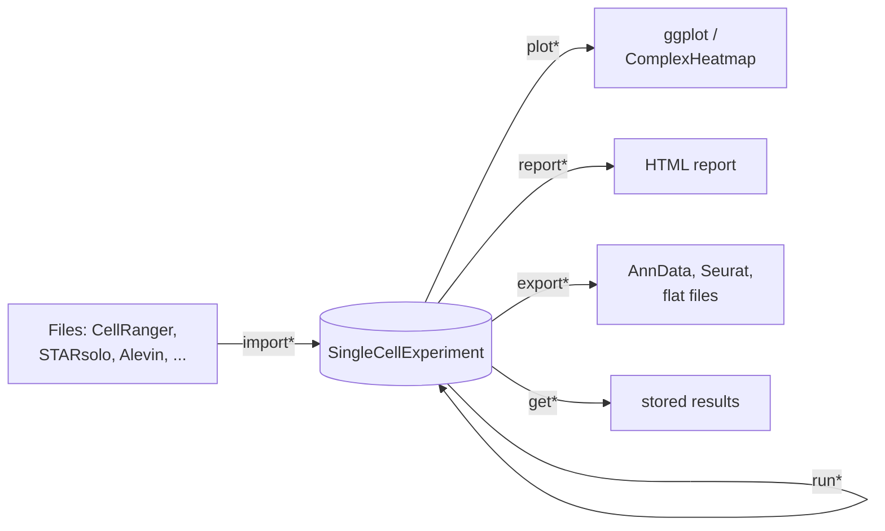
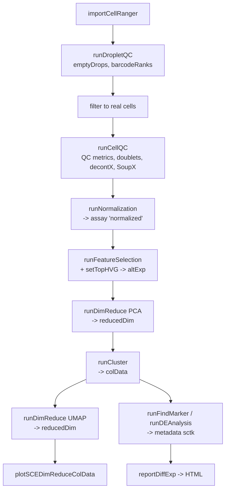

# singleCellTK Architecture

A map of the package for people who need to change it. For the *rules* that govern changes,
see [`adr/`](adr/); for the step-by-step recipe, see
[`adding-a-new-tool.md`](adding-a-new-tool.md).

---

## The shape of the thing

singleCellTK is a **unifying wrapper layer**. It does not implement analysis methods; it wraps
other people's — Seurat, scran, scater, celda, SoupX, SingleR, GSVA, scDblFinder, DropletUtils,
plus a set of Python tools reached through reticulate — behind one consistent interface.

The interface is the `SingleCellExperiment` object. Everything flows through it:



A single object carries the counts, every derived matrix, every annotation, every embedding,
and the full parameter record of everything that produced them. That is what makes steps
composable, and it is the contract described in
[ADR-0001](adr/0001-sce-in-sce-out-contract.md).

## Where things live in the object

```
SingleCellExperiment
├── assays          matrices, genes x cells        counts, logcounts, decontXcounts, SoupX
│                   -> every one is tagged (ADR-0003)
├── colData         per-cell annotation            sample, cluster, QC metrics, doublet scores
├── rowData         per-feature annotation         gene symbols, HVG flags, soup profiles
├── reducedDims     cells x k embeddings           PCA, UMAP, TSNE
├── altExps         differently-shaped sub-objects feature subsets
└── metadata
    ├── $assayType  the tag registry               (tag, assayName) tibble; R/sctkTagging.R
    └── $sctk       everything else                $runEmptyDrops, $runDecontX, ... keyed by
                                                   the function that produced it
```

## `R/` by family

87 files, 251 exported functions. The prefix tells you what a file contains
([ADR-0002](adr/0002-function-naming-families.md)).

| Family | Count | Representative files |
|---|---|---|
| **`import*`** — ingestion | 20 | `importCellRanger.R`, `importAlevin.R`, `importSTARSolo.R`, `importBUStools.R`, `importOptimus.R`, `importSeqc.R`, `importDropEst.R`, `importAnnData.R`, `importGeneSets.R`, `importExampleData.R` |
| **`run*`** — analysis | 68 | `runQC.R`, `runNormalization.R`, `runDimReduce.R`, `runCluster.R`, `runBatchCorrection.R`, `runDEAnalysis.R`, `runFindMarker.R`, `runSoupX.R`, `runSingleR.R`, `runTSCAN.R` |
| **`plot*`** — visualization | 69 | `ggPlotting.R` (the largest file in the package), `plotSCEHeatmap.R`, `plotDEAnalysis.R`, `plotDimRed.R`, `plotBubble.R` |
| **`report*`** — HTML reports | 16 | `htmlReports.R`, rendering templates from `inst/rmarkdown/` |
| **`export*`** — egress | 4 | `exportSCEtoAnndata.R`, `exportSCEtoTXT.R` |
| **`get*`/`set*`/`list*`** — accessors | 22 | co-located with the `run*` that stores the result |

### The load-bearing infrastructure files

These are small, easy to overlook, and central. Read them before changing anything:

| File | What it holds | Why it matters |
|---|---|---|
| **`R/validityFunctions.R`** | `.selectSCEMatrix()`, `.manageCellVar()`, `.manageFeatureVar()`, `.checkSCEValidity()` | The input-validation layer. `.manageCellVar()` has 36 call sites, `.selectSCEMatrix()` 18. Bypassing them is the source of a whole class of unhelpful error message. |
| **`R/sctkTagging.R`** | `expSetDataTag()`, `expTaggedData()`, `expData<-`, `expDeleteDataTag()` | The assay provenance registry. The GUI's assay dropdowns are driven entirely by it. |
| **`R/allGenerics.R`** | S4 generic declarations | Where `expData` and friends are declared |
| **`R/miscFunctions.R`** | assorted utilities | Also holds `.testFunctions()`, dead code that suppresses a `R CMD check` NOTE — see [ADR-0005](adr/0005-dependency-policy.md) |

## The two interfaces

### Console API

The primary interface. `library(singleCellTK)` then call functions directly. Everything else
is built on this.

### Shiny GUI

Launched by `singleCellTK()` (`R/singleCellTK.R:24`), which is a thin shim:

```r
singleCellTK <- function(inSCE = NULL, includeVersion = TRUE, theme = 'yeti') {
  appDir <- system.file("shiny", package = "singleCellTK")
  shiny::shinyOptions(inputSCEset = inSCE)
  shiny::runApp(appDir, display.mode = "normal")
}
```

The app itself is 86 files under `inst/shiny/` — `ui.R`, `server.R`, `helpers.R`, and a set of
`module_*.R` files. **It calls the same exported console functions the user would call.** It
adds no analysis logic of its own; it is a form-builder over the console API.

Two consequences worth knowing:

1. **A new console function is not automatically in the GUI.** Wiring it in is separate work
   in `inst/shiny/`, and is optional.
2. **The GUI is where the dependency problem concentrates.** `shinyjs` alone has 258 call
   sites there and zero in `R/`. See [ADR-0005](adr/0005-dependency-policy.md).

⚠️ `inst/shiny/ui.R:1-9` currently calls `install.packages()` at launch, installing into the
user's library without asking. This is a known defect, not a pattern to copy.

## Python tools via reticulate

Several tools — scanpy, scrublet, bbknn, scanorama — are Python. They are bound in
`R/reticulate_setup.R` at package load:

```r
.onLoad <- function(libname, pkgname) {
  scrublet <<- reticulate::import("scrublet", delay_load = TRUE)
  sc       <<- reticulate::import("scanpy",   delay_load = TRUE)
  ad       <<- reticulate::import("anndata",  delay_load = TRUE, convert = FALSE)
  ...
}
```

`delay_load = TRUE` is the important part: the Python module is not touched until first use,
so the package loads fine without a Python environment and only fails when a Python-backed
function is actually called.

Environment setup is user-driven, via exported helpers: `sctkPythonInstallConda()`,
`sctkPythonInstallVirtualEnv()`, `selectSCTKConda()`, `selectSCTKVirtualEnvironment()`.

Object conversion crosses through `zellkonverter` (SCE ↔ AnnData, 22 call sites in `R/`) and
`R/sce2adata.R`.

⚠️ The documented pip install line (`vignettes/articles/installation.Rmd:20`) omits `anndata`,
which `.onLoad` imports unconditionally. See `docs-audit/readme-and-install.md`.

## Repository layout

```
R/                      87 source files
man/                    237 generated .Rd files — NEVER hand-edit
NAMESPACE               generated — NEVER hand-edit
DESCRIPTION             88 hard dependencies (ADR-0005)
data/                   5 bundled fixtures: scExample, mouseBrainSubsetSCE, sceBatches, ...
tests/testthat/         24 test files
vignettes/
  singleCellTK.Rmd      the only true vignette; ships in the tarball
  articles/             31 pkgdown articles; excluded from the tarball
inst/
  shiny/                86 files — the GUI
  rmarkdown/            templates rendered by report* functions
  extdata/              example data files
exec/                   the SCTK-QC command-line pipeline
docs/                   built pkgdown site (tracked) + these hand-written docs
docs-audit/             the July 2026 audit findings
```

## Data flow through a typical analysis



Every arrow is one function taking `inSCE` and returning `inSCE`. Nothing is passed sideways.

## Known structural problems

Documented so nobody rediscovers them the hard way. Full detail in
[`../docs-audit/`](../docs-audit/).

| Problem | Where |
|---|---|
| 88 hard dependencies; 46 have ≤3 call sites | [ADR-0005](adr/0005-dependency-policy.md), `docs-audit/dependencies.md` |
| `.testFunctions()` suppresses the unused-dependency check | `R/miscFunctions.R:146` |
| GUI installs packages at launch | `inst/shiny/ui.R:1-9` |
| The only shipped vignette is a stub | [ADR-0004](adr/0004-documentation-architecture.md) |
| Articles are outside `R CMD check`, so defects accumulate silently | `docs-audit/articles.md` |
| Assay tag vocabulary has drifted | [ADR-0003](adr/0003-result-storage-and-tagging.md) |
| 35 unverified static bug candidates | `docs-audit/bug-candidates.md` |
| `.travis.yml` remains alongside the live GitHub Actions workflows | repo root |
